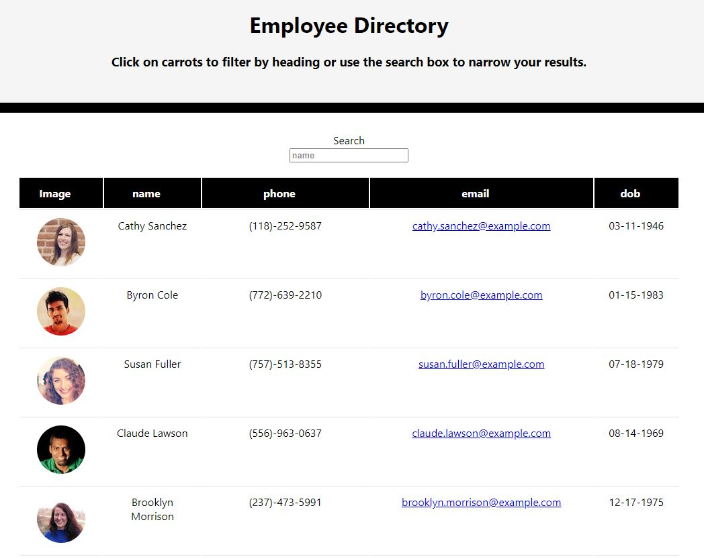

# Employee Directory:

This <a href="https://reactjs.org/"> React</a> application lets you view a list of your employees. You can begin searching by simply typing an employee's name and it will immediately give you a result. You can also sort by clicking categories: name, phone, email, dob.

---

# User Story:
```
As a user, 
I want to be able to view my entire employee directory at once so that I have quick access to their information.
```
---

## Demo:


Visit site <a href="https://jeanhern81.github.io/React-Employee-Directory/">here</a>.

---

## Techonologies Used:

This project was bootstrapped with [Create React App](https://github.com/facebook/create-react-app).
